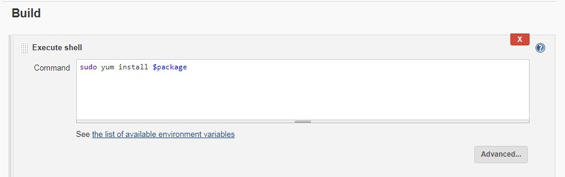

**Create a Jenkins job(InstallPackage) that will take a package name as input and install it in local system.**

create package string parameter.
Configure execute shell with this parameter.





**Modify InstallPackage jenkins job to take remote system IP as input to install the package.**

Configure SSH remote host in jenkins configuration.
Build- Execute shell script on remote host using ssh.


**Modify InstallPackage jenkins job so that it should be able to support different types of OS such as:**  
**Ubuntu 14/16**  
**CentOS 6/7**  

Just replace script as below:
```
which yum
if [ $? == 0 ]
then
    sudo yum install $package
else
    sudo apt-get install $package
fi
```


**Modify InstallPackage jenkins job to take additional parameters for remote system to be managed:**  
**ssh username**  
**PrivateKey file**  


Open EC2 instance *.pem* file and copy key.
Create file **key** in */root/.ssh/key* having this key.
Change permission of this file *sudo chmod 700 key*
Parameterize ssh username, ip, package, key file location


**Modify InstallPackage jenkins job where a drop down will be provided of remote systems to be managed.**  
**Modify InstallPackage jenkins job where checkboxes are provided for multiple remote systems.**  
 


**Create below users in your system**  
**dev**  
**qa**  
**devops**  
**qa user should be allowed only to execute the InstallPackage jenkins job**  
**dev user should be allowed to execute and view the content of InstallPackage jenkins job**  
**devops user should be admin of Jenkins server**  


