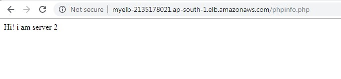

AWS Assignment Day-2


Task 1

Create a vpc not by wizard this time but manually, having 2 public subnets and 2 private subnets and 2 protected subnets.


setup should be highly available


Create 1 IGW and 2 NGW in each availability zone and make the appropriate routes in route tables


Main route will remain intact, instead make 4 route tables


public_route_table
private_route_table_1
private_route_table_2
protected_route_table


Task 2

Make LAMP setup with 2 instances in each private subnets.


Server-1 should serve a webpage that would say "Hi! i am server 1"


Server-2 should serve a webpage that would say "Hi! i am server 2"


Task 3

Launch a public load balancer that would forward the requests to these 2 LAMP instances


create the same setup using aws-cli except vpc


NOTE!

Machines in the protected subnets shouldn't be going to internet and vice versa (verify this by launching an instance in this subnet)
Make Documentation and push to the repo
Make sure you copy the actual logs in the documentation rather than assuming that we'll get it We know nothing

-----------------------------------------------------------------------------  





-------------------------------------------------------------------------  
**Using CLI:**  

Note that VPC is already created.  


* Create subnet:  

**aws ec2 create-subnet --vpc-id vpc-05f9507fbc9dcc1be --cidr-block 10.0.0.0/27 --availability-zone ap-south-1a**

```
{
    "Subnet": {
        "MapPublicIpOnLaunch": false,
        "AvailabilityZoneId": "aps1-az1",
        "AvailableIpAddressCount": 27,
        "DefaultForAz": false,
        "SubnetArn": "arn:aws:ec2:ap-south-1:882209190643:subnet/subnet-07772200af19db730",
        "Ipv6CidrBlockAssociationSet": [],
        "VpcId": "vpc-05f9507fbc9dcc1be",
        "State": "pending",
        "AvailabilityZone": "ap-south-1a",
        "SubnetId": "subnet-07772200af19db730",
        "OwnerId": "882209190643",
        "CidrBlock": "10.0.0.0/27",
        "AssignIpv6AddressOnCreation": false
    }
}
```


**aws ec2 create-subnet --vpc-id vpc-05f9507fbc9dcc1be --cidr-block 10.0.0.32/27 --availability-zone ap-south-1b**

```
{
    "Subnet": {
        "MapPublicIpOnLaunch": false,
        "AvailabilityZoneId": "aps1-az3",
        "AvailableIpAddressCount": 27,
        "DefaultForAz": false,
        "SubnetArn": "arn:aws:ec2:ap-south-1:882209190643:subnet/subnet-07c13ba48e40355b6",
        "Ipv6CidrBlockAssociationSet": [],
        "VpcId": "vpc-05f9507fbc9dcc1be",
        "State": "pending",
        "AvailabilityZone": "ap-south-1b",
        "SubnetId": "subnet-07c13ba48e40355b6",
        "OwnerId": "882209190643",
        "CidrBlock": "10.0.0.32/27",
        "AssignIpv6AddressOnCreation": false
    }
}
```

**aws ec2 create-subnet --vpc-id vpc-05f9507fbc9dcc1be --cidr-block 10.0.0.64/27 --availability-zone ap-south-1a**

```
{
    "Subnet": {
        "MapPublicIpOnLaunch": false,
        "AvailabilityZoneId": "aps1-az1",
        "AvailableIpAddressCount": 27,
        "DefaultForAz": false,
        "SubnetArn": "arn:aws:ec2:ap-south-1:882209190643:subnet/subnet-059d7820aac3ad964",
        "Ipv6CidrBlockAssociationSet": [],
        "VpcId": "vpc-05f9507fbc9dcc1be",
        "State": "pending",
        "AvailabilityZone": "ap-south-1a",
        "SubnetId": "subnet-059d7820aac3ad964",
        "OwnerId": "882209190643",
        "CidrBlock": "10.0.0.64/27",
        "AssignIpv6AddressOnCreation": false
    }
}
```


aws ec2 create-subnet --vpc-id vpc-05f9507fbc9dcc1be --cidr-block 10.0.0.96/27 --availability-zone ap-south-1b

{
    "Subnet": {
        "MapPublicIpOnLaunch": false,
        "AvailabilityZoneId": "aps1-az3",
        "AvailableIpAddressCount": 27,
        "DefaultForAz": false,
        "SubnetArn": "arn:aws:ec2:ap-south-1:882209190643:subnet/subnet-0a8a4f0d3657c60cf",
        "Ipv6CidrBlockAssociationSet": [],
        "VpcId": "vpc-05f9507fbc9dcc1be",
        "State": "pending",
        "AvailabilityZone": "ap-south-1b",
        "SubnetId": "subnet-0a8a4f0d3657c60cf",
        "OwnerId": "882209190643",
        "CidrBlock": "10.0.0.96/27",
        "AssignIpv6AddressOnCreation": false
    }
}

aws ec2 create-subnet --vpc-id vpc-05f9507fbc9dcc1be --cidr-block 10.0.0.128/27 --availability-zone ap-south-1a

{
    "Subnet": {
        "MapPublicIpOnLaunch": false,
        "AvailabilityZoneId": "aps1-az1",
        "AvailableIpAddressCount": 27,
        "DefaultForAz": false,
        "SubnetArn": "arn:aws:ec2:ap-south-1:882209190643:subnet/subnet-060b6852d09e99c3c",
        "Ipv6CidrBlockAssociationSet": [],
        "VpcId": "vpc-05f9507fbc9dcc1be",
        "State": "pending",
        "AvailabilityZone": "ap-south-1a",
        "SubnetId": "subnet-060b6852d09e99c3c",
        "OwnerId": "882209190643",
        "CidrBlock": "10.0.0.128/27",
        "AssignIpv6AddressOnCreation": false
    }
}

aws ec2 create-subnet --vpc-id vpc-05f9507fbc9dcc1be --cidr-block 10.0.0.160/27 --availability-zone ap-south-1b

{
    "Subnet": {
        "MapPublicIpOnLaunch": false,
        "AvailabilityZoneId": "aps1-az3",
        "AvailableIpAddressCount": 27,
        "DefaultForAz": false,
        "SubnetArn": "arn:aws:ec2:ap-south-1:882209190643:subnet/subnet-08603b27a1c22c7e5",
        "Ipv6CidrBlockAssociationSet": [],
        "VpcId": "vpc-05f9507fbc9dcc1be",
        "State": "pending",
        "AvailabilityZone": "ap-south-1b",
        "SubnetId": "subnet-08603b27a1c22c7e5",
        "OwnerId": "882209190643",
        "CidrBlock": "10.0.0.160/27",
        "AssignIpv6AddressOnCreation": false
    }
}


Create route Table:
[root@ip-172-31-22-206 ec2-user]# aws ec2 create-route-table --vpc-id vpc-05f9507fbc9dcc1be
{
    "RouteTable": {
        "Associations": [],
        "RouteTableId": "rtb-09ddbcbb05c547821",
        "VpcId": "vpc-05f9507fbc9dcc1be",
        "PropagatingVgws": [],
        "Tags": [],
        "Routes": [
            {
                "GatewayId": "local",
                "DestinationCidrBlock": "10.0.0.0/24",
                "State": "active",
                "Origin": "CreateRouteTable"
            }
        ],
        "OwnerId": "882209190643"
    }
}
[root@ip-172-31-22-206 ec2-user]# aws ec2 create-route-table --vpc-id vpc-05f9507fbc9dcc1be
{
    "RouteTable": {
        "Associations": [],
        "RouteTableId": "rtb-03e242c2c8a707b27",
        "VpcId": "vpc-05f9507fbc9dcc1be",
        "PropagatingVgws": [],
        "Tags": [],
        "Routes": [
            {
                "GatewayId": "local",
                "DestinationCidrBlock": "10.0.0.0/24",
                "State": "active",
                "Origin": "CreateRouteTable"
            }
        ],
        "OwnerId": "882209190643"
    }
}
[root@ip-172-31-22-206 ec2-user]# aws ec2 create-route-table --vpc-id vpc-05f9507fbc9dcc1be
{
    "RouteTable": {
        "Associations": [],
        "RouteTableId": "rtb-0ff3ad7194ede610f",
        "VpcId": "vpc-05f9507fbc9dcc1be",
        "PropagatingVgws": [],
        "Tags": [],
        "Routes": [
            {
                "GatewayId": "local",
                "DestinationCidrBlock": "10.0.0.0/24",
                "State": "active",
                "Origin": "CreateRouteTable"
            }
        ],
        "OwnerId": "882209190643"
    }
}
[root@ip-172-31-22-206 ec2-user]# aws ec2 create-route-table --vpc-id vpc-05f9507fbc9dcc1be
{
    "RouteTable": {
        "Associations": [],
        "RouteTableId": "rtb-0e37314cee0cccbe4",
        "VpcId": "vpc-05f9507fbc9dcc1be",
        "PropagatingVgws": [],
        "Tags": [],
        "Routes": [
            {
                "GatewayId": "local",
                "DestinationCidrBlock": "10.0.0.0/24",
                "State": "active",
                "Origin": "CreateRouteTable"
            }
        ],
        "OwnerId": "882209190643"
    }
}

Create IG:
aws ec2 create-internet-gateway
{
    "InternetGateway": {
        "Tags": [],
        "Attachments": [],
        "InternetGatewayId": "igw-0728c6083423c4553"
    }
}

Associate IG:
aws ec2 attach-internet-gateway --internet-gateway-id igw-0728c6083423c4553 --vpc-id vpc-05f9507fbc9dcc1be

Create EIP:
[root@ip-172-31-22-206 ec2-user]# aws ec2 allocate-address
{
    "PublicIp": "13.235.164.229",
    "Domain": "vpc",
    "AllocationId": "eipalloc-0b2db31f42f825572",
    "PublicIpv4Pool": "amazon"
}
[root@ip-172-31-22-206 ec2-user]# aws ec2 allocate-address
{
    "PublicIp": "13.235.204.39",
    "Domain": "vpc",
    "AllocationId": "eipalloc-069587acd7a69f224",
    "PublicIpv4Pool": "amazon"
}

Create NAT gateway:
aws ec2 create-nat-gateway --subnet-id subnet-07772200af19db730 --allocation-id eipalloc-0b2db31f42f825572
{
    "NatGateway": {
        "NatGatewayAddresses": [
            {
                "AllocationId": "eipalloc-0b2db31f42f825572"
            }
        ],
        "VpcId": "vpc-05f9507fbc9dcc1be",
        "State": "pending",
        "NatGatewayId": "nat-0ac1b8733eb0762f0",
        "SubnetId": "subnet-07772200af19db730",
        "CreateTime": "2019-07-31T16:31:53.000Z"
    }
}


aws ec2 create-nat-gateway --subnet-id subnet-07c13ba48e40355b6 --allocation-id eipalloc-069587acd7a69f224
{
    "NatGateway": {
        "NatGatewayAddresses": [
            {
                "AllocationId": "eipalloc-069587acd7a69f224"
            }
        ],
        "VpcId": "vpc-05f9507fbc9dcc1be",
        "State": "pending",
        "NatGatewayId": "nat-06bc3336557068fd0",
        "SubnetId": "subnet-07c13ba48e40355b6",
        "CreateTime": "2019-07-31T16:33:20.000Z"
    }
}


Create Route:
aws ec2 create-route --route-table-id rtb-09ddbcbb05c547821 --destination-cidr-block 0.0.0.0/0 --gateway-id igw-0728c6083423c4553

{
    "Return": true
}

aws ec2 create-route --route-table-id rtb-0ff3ad7194ede610f --destination-cidr-block 0.0.0.0/0 --gateway-id nat-0ac1b8733eb0762f0
{
    "Return": true
}

aws ec2 create-route --route-table-id rtb-03e242c2c8a707b27 --destination-cidr-block 0.0.0.0/0 --gateway-id nat-06bc3336557068fd0
{
    "Return": true
}

Associate Route table to subnets:
[root@ip-172-31-22-206 ec2-user]# aws ec2 associate-route-table --route-table-id rtb-09ddbcbb05c547821 --subnet-id subnet-07772200af19db730 --subnet-id subnet-07c13ba48e40355b6
{
    "AssociationId": "rtbassoc-037069af64778115d"
}
[root@ip-172-31-22-206 ec2-user]# aws ec2 associate-route-table --route-table-id rtb-09ddbcbb05c547821 --subnet-id subnet-07772200af19db730
{
    "AssociationId": "rtbassoc-0298d7f43ba7e4a60"
}
[root@ip-172-31-22-206 ec2-user]# aws ec2 associate-route-table --route-table-id rtb-0e37314cee0cccbe4 --subnet-id subnet-060b6852d09e99c3c
{
    "AssociationId": "rtbassoc-0729dab6a4e53da09"
}
[root@ip-172-31-22-206 ec2-user]# aws ec2 associate-route-table --route-table-id rtb-0e37314cee0cccbe4 --subnet-id subnet-08603b27a1c22c7e5
{
    "AssociationId": "rtbassoc-04b7548a2eb39e797"
}
[root@ip-172-31-22-206 ec2-user]# aws ec2 associate-route-table --route-table-id rtb-03e242c2c8a707b27 --subnet-id subnet-0a8a4f0d3657c60cf
{
    "AssociationId": "rtbassoc-073a8449ba1ae32f2"
}
[root@ip-172-31-22-206 ec2-user]# aws ec2 associate-route-table --route-table-id rtb-0ff3ad7194ede610f --subnet-id subnet-059d7820aac3ad964
{
    "AssociationId": "rtbassoc-0e02549b55b64d9c2"
}


Create Security Group:
[root@ip-172-31-22-206 ec2-user]# aws ec2 create-security-group --group-name Public --description "Public" --vpc-id vpc-05f9507fbc9dcc1be

An error occurred (InvalidGroup.Duplicate) when calling the CreateSecurityGroup operation: The security group 'Public' already exists for VPC 'vpc-05f9507fbc9dcc1be'
[root@ip-172-31-22-206 ec2-user]# aws ec2 create-security-group --group-name Public --description "Public" --vpc-id vpc-05f9507fbc9dcc1be
{
    "GroupId": "sg-0d45e0b943bd38fed"
}
[root@ip-172-31-22-206 ec2-user]# aws ec2 create-security-group --group-name Private --description "Private" --vpc-id vpc-05f9507fbc9dcc1be
{
    "GroupId": "sg-06d2041e3b087dec7"
}
[root@ip-172-31-22-206 ec2-user]# aws ec2 create-security-group --group-name Protected --description "Protected" --vpc-id vpc-05f9507fbc9dcc1be
{
    "GroupId": "sg-0024ff50bf2c359c1"
}


Configure Security Group:

[root@ip-172-31-22-206 ec2-user]# aws ec2 authorize-security-group-ingress --group-id sg-0d45e0b943bd38fed --protocol tcp --port 80 --cidr 0.0.0.0/0

[root@ip-172-31-22-206 ec2-user]# aws ec2 authorize-security-group-ingress --group-id sg-06d2041e3b087dec7 --protocol tcp --port 80 --source-group sg-0d45e0b943bd38fed

Launch 2 instances, 1 in each private subnet, along with launch script:
aws ec2 run-instances --image-id ami-0d2692b6acea72ee6 --count 1 --instance-type t2.micro --key-name NewKeyPair --security-group-ids sg-06d2041e3b087dec7 --subnet-id subnet-059d7820aac3ad964 --user-data file://launch_script_1.txt

{
    "Instances": [
        {
            "Monitoring": {
                "State": "disabled"
            },
            "PublicDnsName": "",
            "StateReason": {
                "Message": "pending",
                "Code": "pending"
            },
            "State": {
                "Code": 0,
                "Name": "pending"
            },
            "EbsOptimized": false,
            "LaunchTime": "2019-07-31T17:13:59.000Z",
            "PrivateIpAddress": "10.0.0.75",
            "ProductCodes": [],
            "VpcId": "vpc-05f9507fbc9dcc1be",
            "CpuOptions": {
                "CoreCount": 1,
                "ThreadsPerCore": 1
            },
            "StateTransitionReason": "",
            "InstanceId": "i-054341c4a067cdd07",
            "ImageId": "ami-0d2692b6acea72ee6",
            "PrivateDnsName": "ip-10-0-0-75.ap-south-1.compute.internal",
            "KeyName": "NewKeyPair",
            "SecurityGroups": [
                {
                    "GroupName": "Private",
                    "GroupId": "sg-06d2041e3b087dec7"
                }
            ],
            "ClientToken": "",
            "SubnetId": "subnet-059d7820aac3ad964",
            "InstanceType": "t2.micro",
            "CapacityReservationSpecification": {
                "CapacityReservationPreference": "open"
            },
            "NetworkInterfaces": [
                {
                    "Status": "in-use",
                    "MacAddress": "02:6b:c1:13:9c:b8",
                    "SourceDestCheck": true,
                    "VpcId": "vpc-05f9507fbc9dcc1be",
                    "Description": "",
                    "NetworkInterfaceId": "eni-0d40d049ab44d6046",
                    "PrivateIpAddresses": [
                        {
                            "Primary": true,
                            "PrivateIpAddress": "10.0.0.75"
                        }
                    ],
                    "SubnetId": "subnet-059d7820aac3ad964",
                    "Attachment": {
                        "Status": "attaching",
                        "DeviceIndex": 0,
                        "DeleteOnTermination": true,
                        "AttachmentId": "eni-attach-0b046cbdf307cc1a1",
                        "AttachTime": "2019-07-31T17:13:59.000Z"
                    },
                    "Groups": [
                        {
                            "GroupName": "Private",
                            "GroupId": "sg-06d2041e3b087dec7"
                        }
                    ],
                    "Ipv6Addresses": [],
                    "OwnerId": "882209190643",
                    "PrivateIpAddress": "10.0.0.75"
                }
            ],
            "SourceDestCheck": true,
            "Placement": {
                "Tenancy": "default",
                "GroupName": "",
                "AvailabilityZone": "ap-south-1a"
            },
            "Hypervisor": "xen",
            "BlockDeviceMappings": [],
            "Architecture": "x86_64",
            "RootDeviceType": "ebs",
            "RootDeviceName": "/dev/xvda",
            "VirtualizationType": "hvm",
            "AmiLaunchIndex": 0
        }
    ],
    "ReservationId": "r-00c385d33eadbd42e",
    "Groups": [],
    "OwnerId": "882209190643"
}


aws ec2 run-instances --image-id ami-0d2692b6acea72ee6 --count 1 --instance-type t2.micro --key-name NewKeyPair --security-group-ids sg-06d2041e3b087dec7 --subnet-id subnet-0a8a4f0d3657c60cf --user-data file://launch_script_2.txt

{
    "Instances": [
        {
            "Monitoring": {
                "State": "disabled"
            },
            "PublicDnsName": "",
            "StateReason": {
                "Message": "pending",
                "Code": "pending"
            },
            "State": {
                "Code": 0,
                "Name": "pending"
            },
            "EbsOptimized": false,
            "LaunchTime": "2019-07-31T17:15:32.000Z",
            "PrivateIpAddress": "10.0.0.103",
            "ProductCodes": [],
            "VpcId": "vpc-05f9507fbc9dcc1be",
            "CpuOptions": {
                "CoreCount": 1,
                "ThreadsPerCore": 1
            },
            "StateTransitionReason": "",
            "InstanceId": "i-013dfbc1f32df3c07",
            "ImageId": "ami-0d2692b6acea72ee6",
            "PrivateDnsName": "ip-10-0-0-103.ap-south-1.compute.internal",
            "KeyName": "NewKeyPair",
            "SecurityGroups": [
                {
                    "GroupName": "Private",
                    "GroupId": "sg-06d2041e3b087dec7"
                }
            ],
            "ClientToken": "",
            "SubnetId": "subnet-0a8a4f0d3657c60cf",
            "InstanceType": "t2.micro",
            "CapacityReservationSpecification": {
                "CapacityReservationPreference": "open"
            },
            "NetworkInterfaces": [
                {
                    "Status": "in-use",
                    "MacAddress": "0a:b3:b7:cb:b8:ba",
                    "SourceDestCheck": true,
                    "VpcId": "vpc-05f9507fbc9dcc1be",
                    "Description": "",
                    "NetworkInterfaceId": "eni-09337bfa6fc165153",
                    "PrivateIpAddresses": [
                        {
                            "Primary": true,
                            "PrivateIpAddress": "10.0.0.103"
                        }
                    ],
                    "SubnetId": "subnet-0a8a4f0d3657c60cf",
                    "Attachment": {
                        "Status": "attaching",
                        "DeviceIndex": 0,
                        "DeleteOnTermination": true,
                        "AttachmentId": "eni-attach-06cf26ae55c14e970",
                        "AttachTime": "2019-07-31T17:15:32.000Z"
                    },
                    "Groups": [
                        {
                            "GroupName": "Private",
                            "GroupId": "sg-06d2041e3b087dec7"
                        }
                    ],
                    "Ipv6Addresses": [],
                    "OwnerId": "882209190643",
                    "PrivateIpAddress": "10.0.0.103"
                }
            ],
            "SourceDestCheck": true,
            "Placement": {
                "Tenancy": "default",
                "GroupName": "",
                "AvailabilityZone": "ap-south-1b"
            },
            "Hypervisor": "xen",
            "BlockDeviceMappings": [],
            "Architecture": "x86_64",
            "RootDeviceType": "ebs",
            "RootDeviceName": "/dev/xvda",
            "VirtualizationType": "hvm",
            "AmiLaunchIndex": 0
        }
    ],
    "ReservationId": "r-0d07a5b7d52f5f96e",
    "Groups": [],
    "OwnerId": "882209190643"
}

Create Classic ELB:
aws elb create-load-balancer --load-balancer-name my-load-balancer --listeners "Protocol=HTTP,LoadBalancerPort=80,InstanceProtocol=HTTP,InstancePort=80" --subnets subnet-07772200af19db730 subnet-07c13ba48e40355b6 --security-groups sg-0d45e0b943bd38fed

{
    "DNSName": "my-load-balancer-508971471.ap-south-1.elb.amazonaws.com"
}

Register-instances-with-load-balancer:
aws elb register-instances-with-load-balancer --load-balancer-name my-load-balancer --instances i-013dfbc1f32df3c07 i-054341c4a067cdd07

{
    "Instances": [
        {
            "InstanceId": "i-054341c4a067cdd07"
        },
        {
            "InstanceId": "i-013dfbc1f32df3c07"
        }
    ]
}

ALL DONE:::::------
http://my-load-balancer-508971471.ap-south-1.elb.amazonaws.com/phpinfo.php


