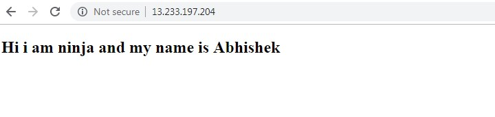
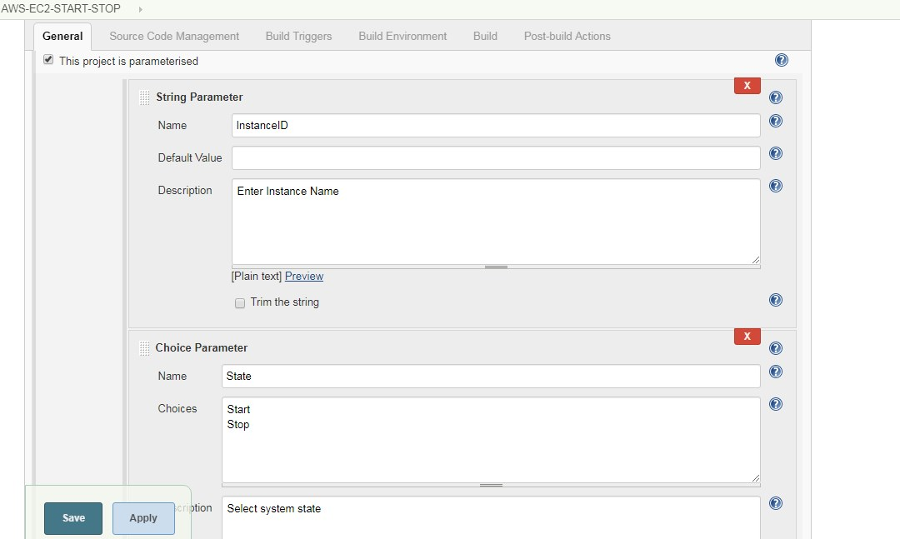
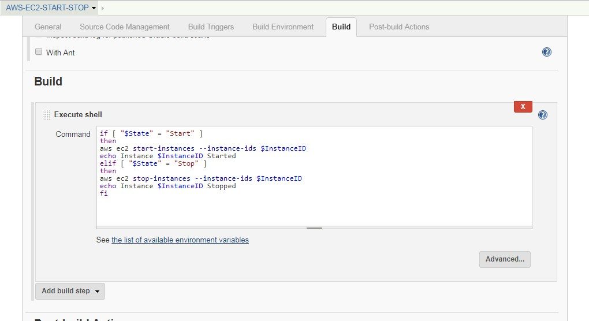
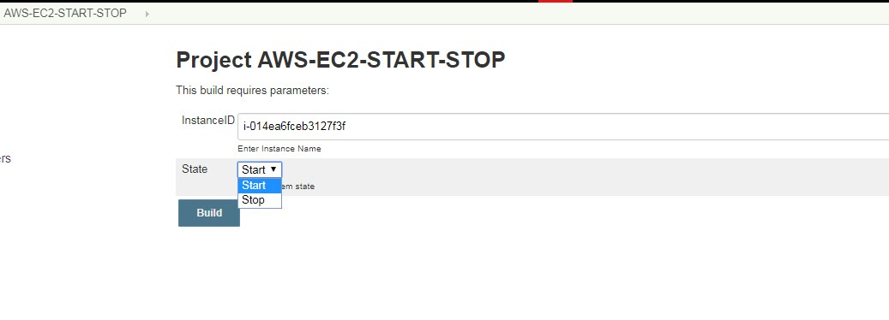
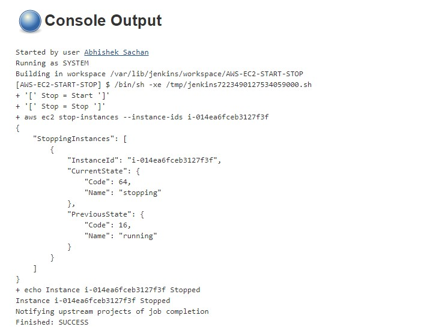
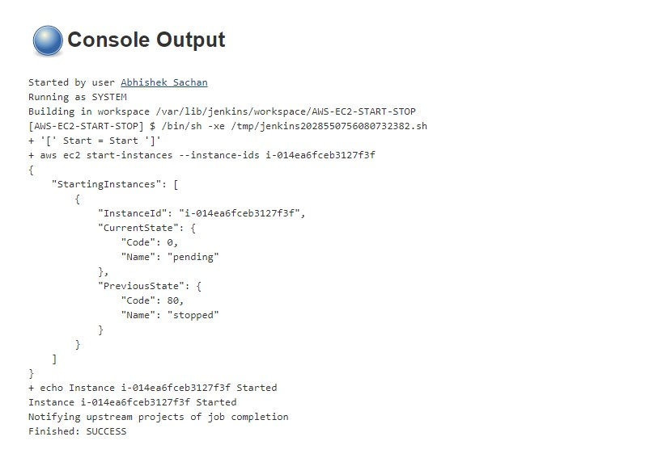

 AWS Assignment Day-3


Task 1

Create a linux t2.micro ec2 instance. After logging into this instance move /etc/sudoers file with /etc/sudoers.bkp


Now try to login, If can't - resolve this issue


Task 2

create an ansible role before pushing the same to your public github repository.


This Role will simply host an nginx webpage saying


"Hi i am ninja and my name is {yourname}"


Execute this role in user data script while launching another instance


Your website should be up & running after the system boots up


tag this instance as ninja:yourname


Task 3

write a jobDsl to start stop this instance through jenkins


NOTE!

Make Documentation
Don't commit and push your AWS Keys on any public repository    

----------------------------------------------------------------------  

Task1:  
* Start a other Debug Linux Instance.  
* Make sure that it is running in the same Availability Zone as the sacrificial server.  
* Fix the bad Server:  
* Stop but do not terminate the bad server, detach bad server root drive and attach it to debug server,  
* then mount its root disk drive as a normal data drive on the debug server, to get access to the sudoer file.   
* Rename sudoers.bkp to sudoers. 
 

```
 $ cd /
 $ sudo mkdir bad
 $ sudo mount /dev/xvdf /bad 
```
```
 $ cd /bad
 $ ls 
```
* sudo mv /etc/sudoers.bkp /etc/sudoers  

* Detach EBS from debug server and attach it again to bad server.  

Start bad server and login... BANG....it works!!!  

-------------------------------------------------------------------------  

Task 2:  

*Created role and placed in `https://github.com/sachan007/ansible-pull.git `   

Launch EC2 instance with Linux AMI with user data as below and port 80 open:  

```
#!/bin/bash  
pip install ansible  
sudo yum install git -y  
/usr/local/bin/ansible-pull -U https://github.com/sachan007/ansible-pull.git -i hosts main.yml  
```

You can check was performed at startup in:-  
`/var/log/cloud-init-output.log`  

  

----------------------------------------------------------------------  

Task 3:  
Pre: Create an IAM User with Acess and Secret Key (policy:AmazonEC2FullAccess or You can create custom policy as below)  


```
{
"Version": "2012-10-17",
"Statement": [
{
"Sid": "VisualEditor0",
"Effect": "Allow",
"Action": [
"ec2:StartInstances",
"ec2:StopInstances"
],
"Resource": "*"
}
]
}
```
AWS cli should be configures with jenkins user in jenkins server, if not follow as below:  
```
$ sudo apt-/yum install awscli
# sudo su – jenkins
$ aws configure
```
Create Jenkins Job to start and Stop Ec2 instance  
With:  
String parameter: InstanceID  
Choice parameter: State Choices: Start and Stop  

Build:  
```
if [ "$State" = "Start" ]
then
aws ec2 start-instances --instance-ids $InstanceID
echo Instance $InstanceID Started
elif [ "$State" = "Stop" ]
then
aws ec2 stop-instances --instance-ids $InstanceID
echo Instance $InstanceID Stopped
fi
```





