* Go to https://www.freenom.com  

* Buy a free domain  (ninjaopstree.tk)  

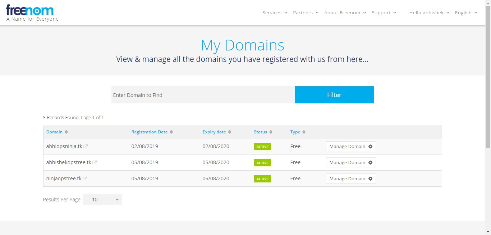  

* Go to manage page of your created domain.  

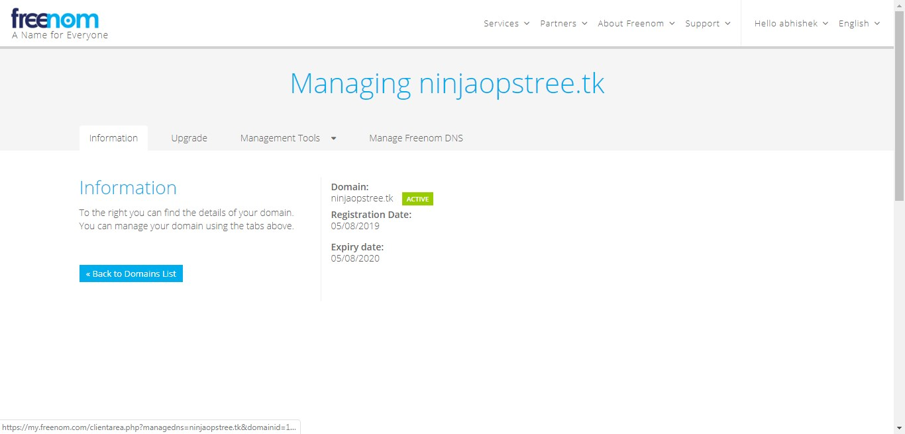  

* Edit name server. (Now get name servers fron AWS route53 and fill here)  

* AWS route 53- Hosted zones- Create hosted zone using your domain created in freenom.  (ninjaopstree.tk)  

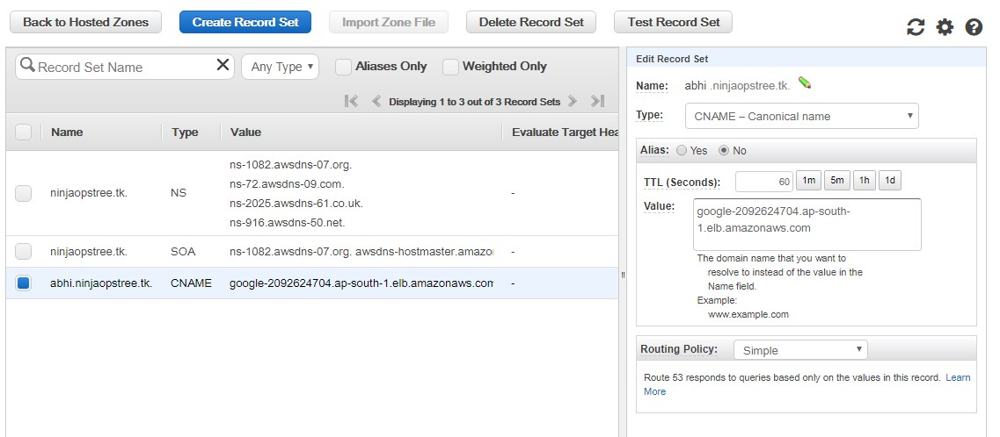  

* Pick atleast 2 of ns record and paste them in freenom edit nameserver page and save.  

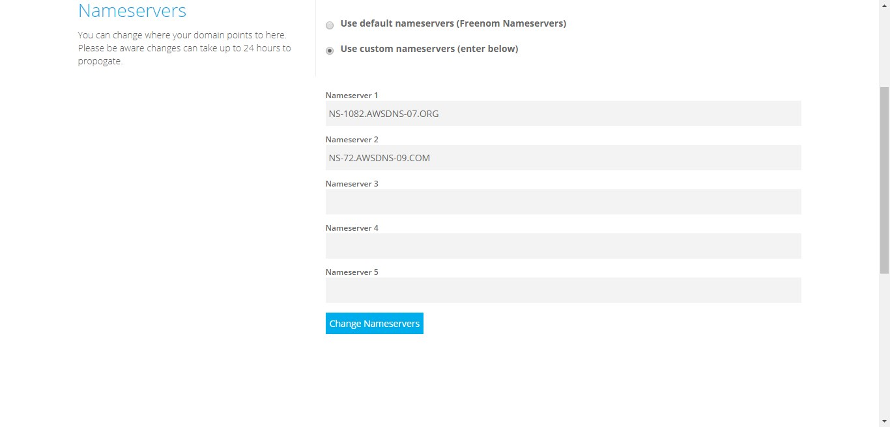  

* Create classic ELB for jenkins server @Port 8090. 

* ELB Listner:   

* Load Balancer Protocol: HTTP  

* Load Balancer Port: 80  

* Instance Protocol: HTTP  

* Instance Port: 8090  

* Health check:  

* Ping protocol: HTTP  

* Ping Port: 8090  

* Ping Path: /login?from=%2F  

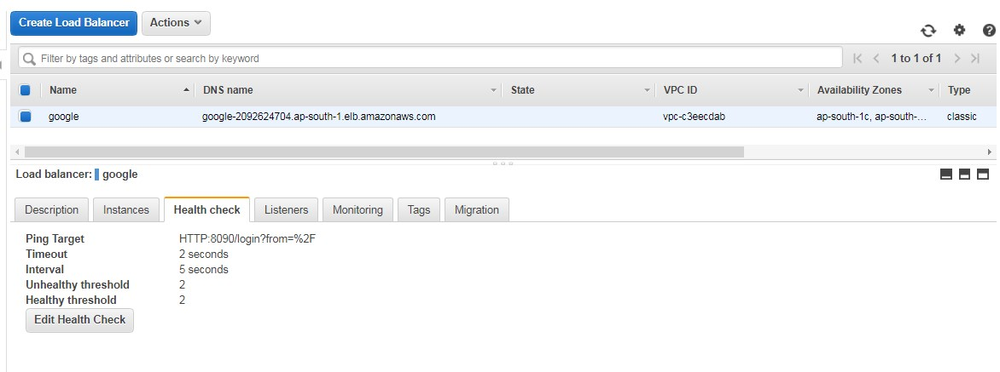  

* Open hosted zone you created and add a CNAME record with classic ELB Pointing to jenkins server.  

  

* Go to https://console.developers.google.com  

* Create project- Select it- Create credential Create OAuth client ID in project  

* Name: Any  

* Authorized JavaScript origins: http://abhi.ninjaopstree.tk  (CNAME record created in route 53)  

* Authorized redirect URIs: http://abhi.ninjaopstree.tk/securityRealm/finishLogin  

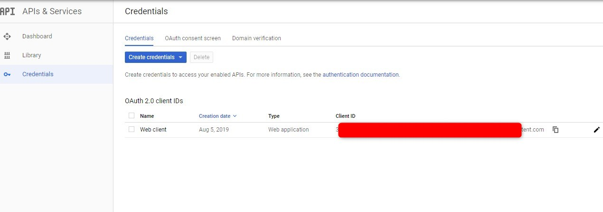  
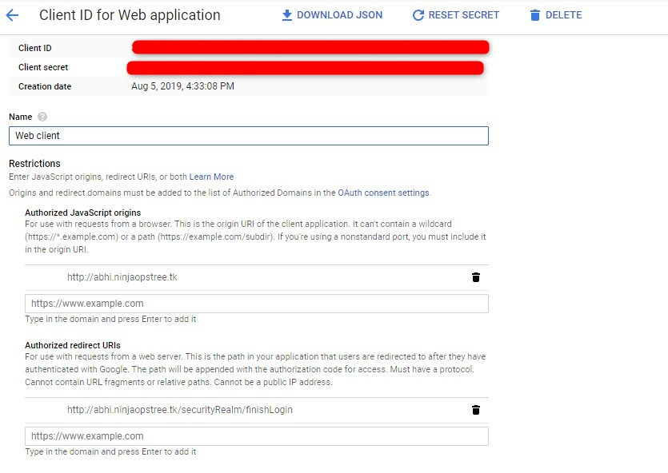  

* Save and get Client ID	and Client secret frm here to use in jenkins.  

* Hit http://abhi.ninjaopstree.tk in browser , you must be able to get jenkins login page.  

* Log in to Jenkins console.  

* Manage Jenkins- Configure Global Security- Access control.  

* Security Realm:  

* Select login with google. ( In case this option is not available install Googlr login or Google OAuth plugin)  

* Paste Client ID and Client Secret copied from API created at Google devlopers console.  

* Check: Use Root URL from request  

* Authorization:  

* Role-Based Strategy.

* Go to Manage jenkins- Manage and Assign Roles  

* Assign Role- Add user(abhishek@gmail.com) and add roles to it.  
 
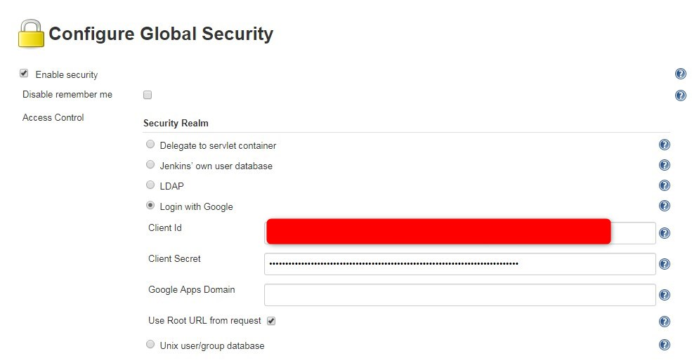  
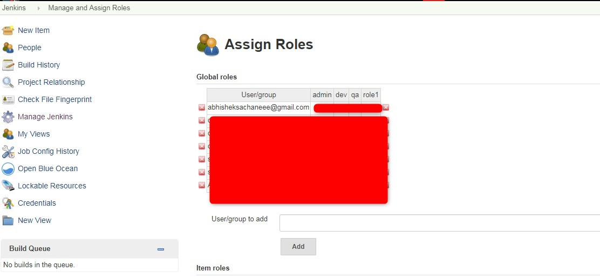     

* Hit http://abhi.ninjaopstree.tk  

* This time you will be redirected to google login page.  

* Use email pass of gmail id added to jenkins. You should be able to login succesfully.  

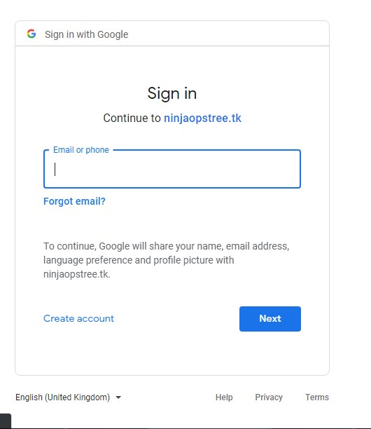  
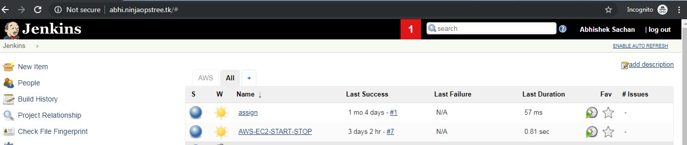  