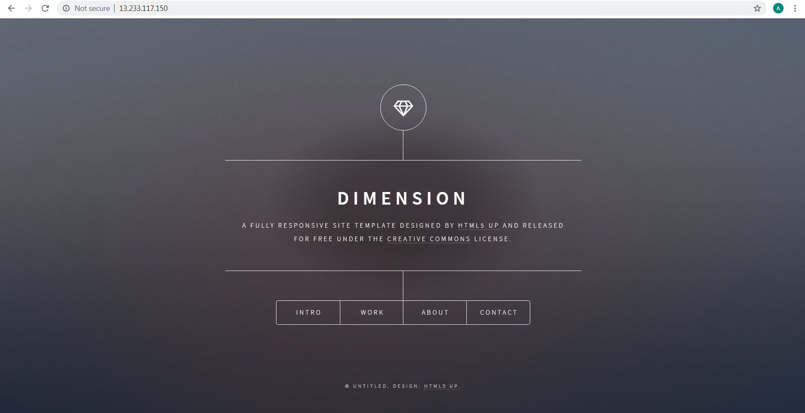
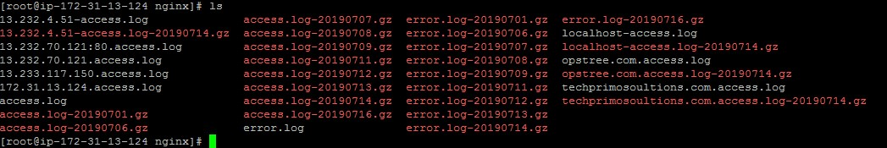
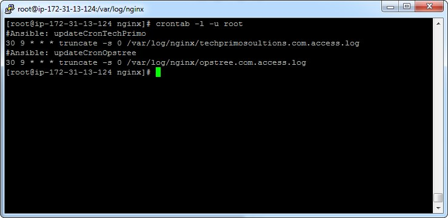

**Install python3 on your machine.  
Print operating system of your machine.  
Install nginx.  
Host https://github.com/cloudacademy/static-website-example via nginx.  
Host above website as opstree.com, make sure the logs should be stored as /var/log/nginx/opstree.com.access.log and /var/log/nginx/opstree.com.error.log  
Host abvoe website as techprimosoultions.com, make sure the logs should be stored as /var/log/nginx/techprimosoultions.com.log and /var/log/nginx/techprimosoultions.com.error.log  
Make sure that the hosted website is accessible only from localhost  
Create a utility that will run every morning at 9:30 am that will clean up the nginx logs.**
  
------------------------------------------------------------------------------------------------------------------    
$ ansible -m yum -a "name=python3 state=present" ninja -b  
Consol output:  
```
ninja | SUCCESS => {
    "changed": true,
    "failed": false,
    "msg": "",
    "rc": 0,
    "results": [
        "Loaded plugins: extras_suggestions, langpacks, priorities, update-motd\n198 packages excluded due to repository priority protections\nResolving Dependencies\n-->  
        Running transaction check\n---> Package python3.x86_64 0:3.7.3-1.amzn2.0.1 will be installed\n--> Processing Dependency: python3-libs(x86-64) = 3.7.3-1.amzn2.0.1 for
        package: python3-3.7.3-1.amzn2.0.1.x86_64\n--> Processing Dependency: python3-setuptools for package: python3-3.7.3-1.amzn2.0.1.x86_64\n--> Processing Dependency:  
        python3-pip for package: python3-3.7.3-1.amzn2.0.1.x86_64\n--> Processing Dependency: libpython3.7m.so.1.0()(64bit) for package: python3-3.7.3-1.amzn2.0.1.x86_64\n-->
        Running transaction check\n---> Package python3-libs.x86_64 0:3.7.3-1.amzn2.0.1 will be installed\n---> Package python3-pip.noarch 0:9.0.3-1.amzn2.0.1 will be  
        installed\n---> Package python3-setuptools.noarch 0:38.4.0-3.amzn2.0.6 will be installed\n--> Finished Dependency Resolution\n\nDependencies  
        Resolved\n\n================================================================================\n Package                Arch       Version                 Repository  
        Size\n================================================================================\nInstalling:\n python3                x86_64     3.7.3-1.amzn2.0.1        
        amzn2-core      70 k\nInstalling for dependencies:\n python3-libs           x86_64     3.7.3-1.amzn2.0.1       amzn2-core     9.0 M\n python3-pip            noarch   
        9.0.3-1.amzn2.0.1       amzn2-core     1.9 M\n python3-setuptools     noarch     38.4.0-3.amzn2.0.6      amzn2-core     617 k\n\nTransaction  
        Summary\n================================================================================\nInstall  1 Package (+3 Dependent packages)\n\nTotal download size: 12  
        M\nInstalled size: 50 M\nDownloading packages:\n--------------------------------------------------------------------------------\nTotal                                
        32 MB/s |  12 MB  00:00     \nRunning transaction check\nRunning transaction test\nTransaction test succeeded\nRunning transaction\n  Installing :   python3-libs-3.7.3-1.amzn2.0.1.x86_64                        1/4 \n  Installing : python3-3.7.3-1.amzn2.0.1.x86_64                             2/4 \n  Installing :  
        python3-setuptools-38.4.0-3.amzn2.0.6.noarch                 3/4 \n  Installing : python3-pip-9.0.3-1.amzn2.0.1.noarch                         4/4 \n  Verifying  :  
        python3-setuptools-38.4.0-3.amzn2.0.6.noarch                 1/4 \n  Verifying  : python3-libs-3.7.3-1.amzn2.0.1.x86_64                        2/4 \n  Verifying  :  
        python3-3.7.3-1.amzn2.0.1.x86_64                             3/4 \n  Verifying  : python3-pip-9.0.3-1.amzn2.0.1.noarch                         4/4 \n\nInstalled:\n   
        python3.x86_64 0:3.7.3-1.amzn2.0.1                                            \n\nDependency Installed:\n  python3-libs.x86_64 0:3.7.3-1.amzn2.0.1                
        \n  python3-pip.noarch 0:9.0.3-1.amzn2.0.1                                        \n  python3-setuptools.noarch 0:38.4.0-3.amzn2.0.6                              
        \n\nComplete!\n"  
    ]  
}  
```
$ ansible -m setup -a "filter=ansible_os_family" ninja  

$ ansible -m yum -a "name=nginx state=present" ninja  

$ ansible -m git -a "repo=https://github.com/cloudacademy/static-website-example.git dest=/usr/share/nginx/html" ninja -b  

$ ansible -m service -a "name=nginx state=restarted" ninja -b  

  

Copy nginx.conf with following changes:  
ansible -m copy -a "src=nginx.conf dest=/etc/nginx/nginx.conf" ninjas -b  

```
access_log  /var/log/nginx/$http_host.access.log  main;  

        server_name  opstree.com
                     techprimosoultions.com;
```
Now check that seperate logs are created or not:  

$curl techprimosoultions.com  
$curl opstree.com  

   


$ ansible -m cron -a "name=updateCronOpstree minute=30 hour=9 job='truncate -s 0 /var/log/nginx/opstree.com.access.log'" ninjas -b  
$ ansible -m cron -a "name=updateCronOpstree minute=30 hour=9 job='truncate -s 0 /var/log/nginx/techprimosoultions.com.access.log'" ninjas -b  

Check node is updated:  
 


