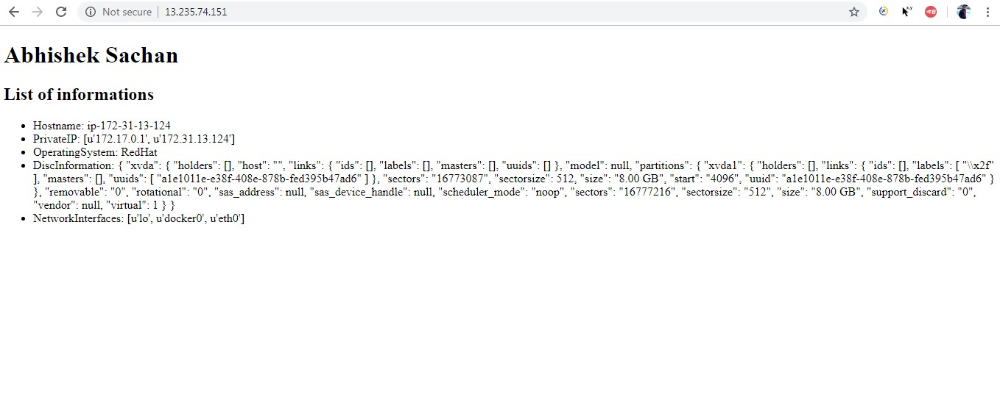

**Write a playbook to create a user along with below steps.  
Home directory as /home/username  
Provide shell /bin/bash  
Create a group and add user into that group.**  

```
---
- hosts: ninjas
  vars:
    http_port: 80
  tasks:
  - name: Create user test with shell and home
    user:
      name: test
      shell: /bin/bash
      home: /home/test
    become: yes
  - name: create new group test1
    group:
      name: test1
      state: present
    become: yes
  - name: Add test user to test1 group
    user:
      name: test
      group: test1
    become: yes
```

  


**Write a playbook to fetch system info like  
Hostname  
IP addresses (public, private)  
Operating System  
RAM information (total, used, free)  
Disk information (total,used, free)  
Available Network Devices. **  

```
---
- hosts: ninjas
  tasks:
  - name: Display public ip
    ipify_facts:
    register: public_ip
  - name: Node info
    vars:
      msg: |
        Hostname: {{ ansible_hostname }}
        PrivateIP: {{ ansible_all_ipv4_addresses }}
        PublicIP: {{ public_ip }}
        OperatingSystem: {{ ansible_os_family }}
        DiscInformation: {{ ansible_devices | to_nice_json }}
        NetworkInterfaces: {{ ansible_interfaces }}
        NetworkI: {{ win_dsc }}
    debug:
        msg: "{{ msg.split('\n') }}"
```

 


**Write a playbook to install nginx along with below steps.  
Start nginx service  
Stop nginx service  
Along with hosting a custom HTML Page on it displaying your Name and system information which we are fetching above.  
Restart nginx service **  

```
---
- hosts: ninjas
  tasks:
  - name: ensure nginx is started
    service:
      name: nginx.service
      state: started
    become: yes
  - name: ensure nginx is stopped
    service:
      name: nginx
      state: stopped
    become: yes
  - name: write the nginx index.html file
    template:
      src: /etc/ansible/nginx.index.html.j2
      dest: /usr/share/nginx/html/index.html
    become: yes
    notify: restart nginx
  - name: ensure nginx is restarted
    service:
      name: nginx.service
      state: restarted
    become: yes
```

*  nginx.index.html.j2:-  

```
 <!DOCTYPE html>
<html>
<body>
<h1>Abhishek Sachan</h1>
<h2>List of informations</h2>

<ul>
  <li>Hostname: {{ ansible_hostname }}</li>
  <li>PrivateIP: {{ ansible_all_ipv4_addresses }}</li>
  <li>OperatingSystem: {{ ansible_os_family }}</li>
  <li>DiscInformation: {{ ansible_devices | to_nice_json }}</li>
  <li>NetworkInterfaces: {{ ansible_interfaces }}</li>
</ul>
</body>
</html>
```


  
