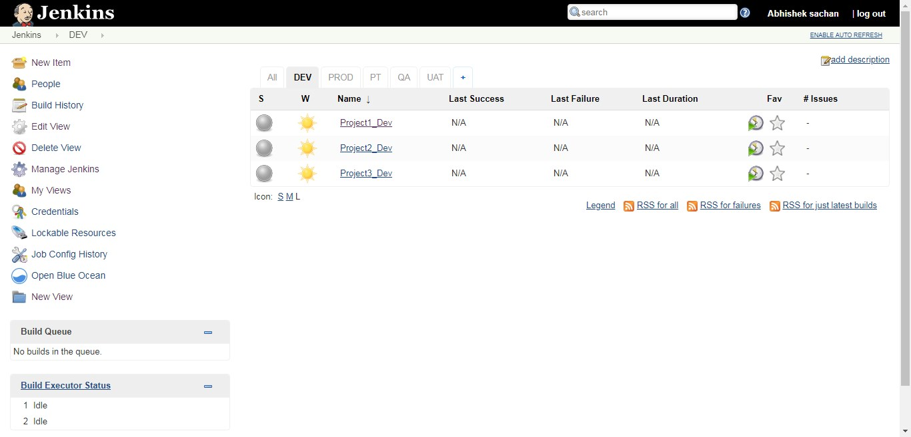
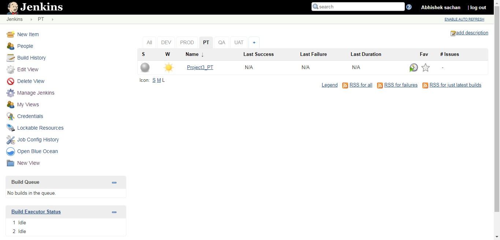
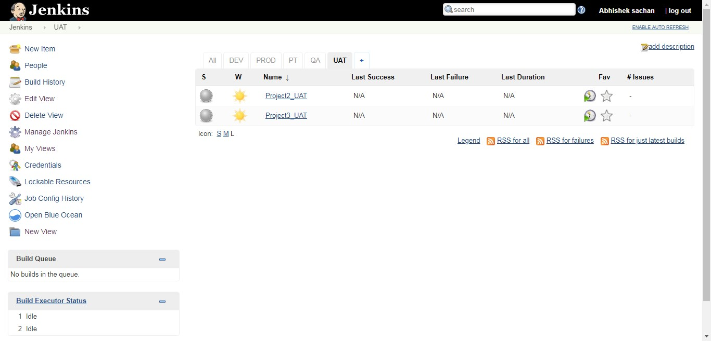

**Task**

Let's assume you are working on 3 projects, PROJECT1, PROJECT2, PROJECT3
Project1 has 3 environments DEV, QA, PROD
Project2 has 4 environment DEV, QA, UAT, PROD
Project3 has 5 environment DEV, QA, UAT, PT, PROD
Now as you are already aware for each project you will have CI jobs and deployment jobs, create dummy jobs.
Arrange your jobs in Jenkins in such a fashion that it will be easy to manage them and for a new person it will be pretty easy to understand which job belong to which project.

**Solution:**

Created 5 different views DEV, QA, UAT, PT, PROD and put each projects corresponding view them.








**Task**

**Create a Jenkins job(ManageTemplate) that will take a template file, property file(value of variables used in template file) and location as input and then create a file in local system.**  
Create template.sh  
```
#!/bin/bash  
echo "My name is $1"  
echo "I am a devops $2"  
```
Create property file  
```
1 = Abhishek  
2 = Ninja 
```
Now create  ManageTemplate job as below:  


